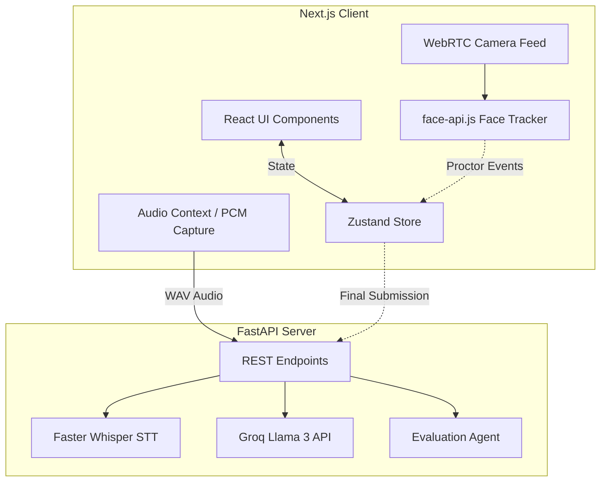
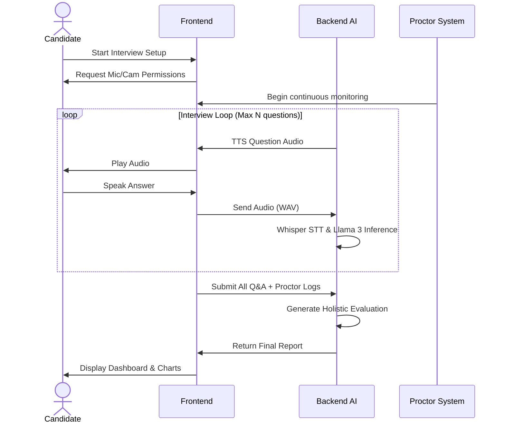
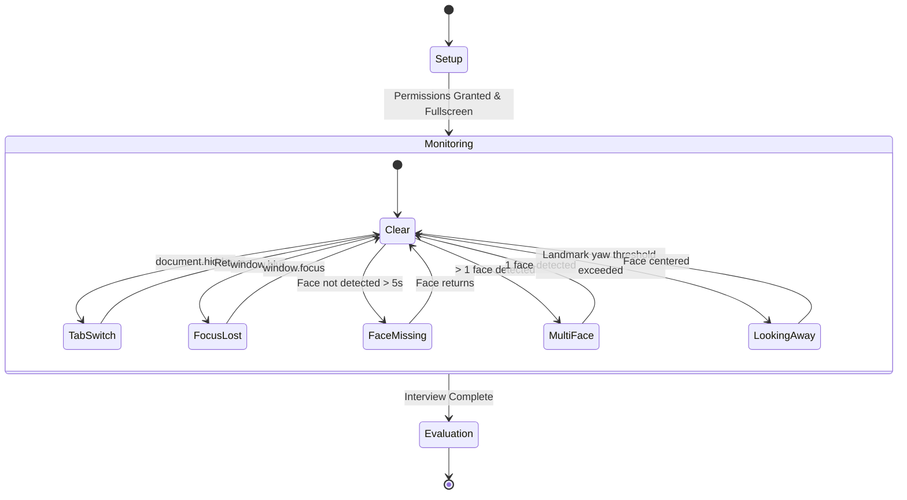

# 🎓 CAT AI Interviewer


**CAT AI Interviewer** is an advanced, fully-automated, proctored mock interview platform designed specifically for CAT/MBA aspirants. It conducts rigorous, dynamic, conversational interviews using state-of-the-art AI, while enforcing strict integrity checks through client-side proctoring.

---

## ✨ Features

- **🧠 Dynamic IIM-Style Interviewing**: Powered by **Groq / Llama 3**, the system asks highly contextual, probing questions based on the candidate's resume, pivoting to new topics dynamically.
- **🗣️ Real-time Voice Interaction**: High-speed offline transcription using **Faster Whisper** and instant Text-To-Speech integration.
- **🛡️ Advanced Live Proctoring**: 
  - Face detection & tracking via `face-api.js`
  - Tab switch detection
  - Window focus tracking
  - Fullscreen enforcement
- **📊 Comprehensive Analytics Dashboard**: Beautiful, multi-tabbed evaluation reports featuring radar charts, competency scoring, proctor logs, and a full interview transcript.

---

## 🏗️ System Architecture

The application is built on a decoupled architecture, separating the real-time client interface from the heavy AI processing backend.



---

## 🔄 Interview Workflow

The candidate experiences a seamless, automated flow from hardware setup to final evaluation.



---

## 🛡️ Proctoring State Machine

The integrity of the interview is maintained strictly on the client side, logging violations to be factored into the final **Integrity Score**.



---

## 🚀 Getting Started

### Prerequisites
- Node.js 18+
- Python 3.10+
- Groq API Key

### 1. Backend Setup

```bash
cd backend
python -m venv venv
source venv/bin/activate  # Or `venv\Scripts\activate` on Windows
pip install -r requirements.txt
```

Set up your environment variables:
Create a `.env` file in the `backend` directory:
```env
GROQ_API_KEY=your_api_key_here
```

Run the FastAPI server:
```bash
uvicorn app.main:app --reload --port 8000
```

### 2. Frontend Setup

```bash
cd frontend
npm install
npm run dev
```

The application will be available at `http://localhost:3000`.

---

## 🎨 Design Philosophy

- **No Dark Mode**: The UI is explicitly designed in a clean, professional, premium light-theme utilizing Tailwind's `zinc`, `blue`, and `emerald` color palettes to simulate a formal examination environment.
- **Micro-interactions**: Extensive use of pulsing animations, gradient borders, and smooth transitions to keep the candidate engaged and aware of the system's state (e.g., listening, evaluating, speaking).

---

Made with ❤️ for MBA Aspirants.
